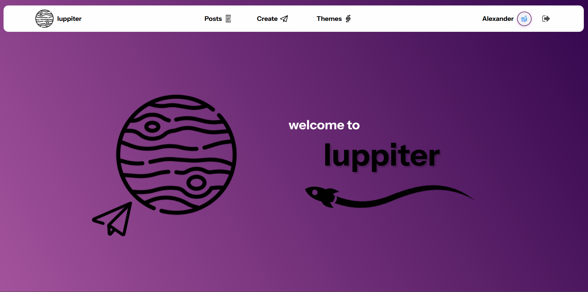
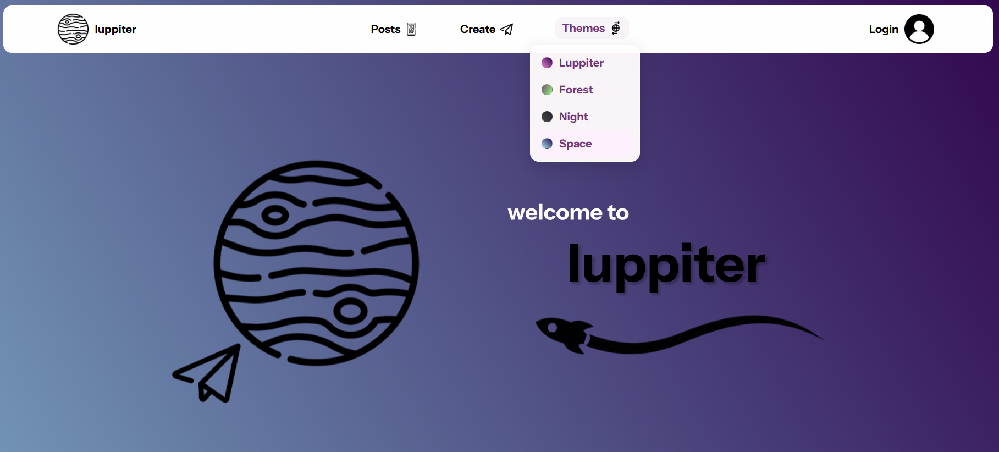
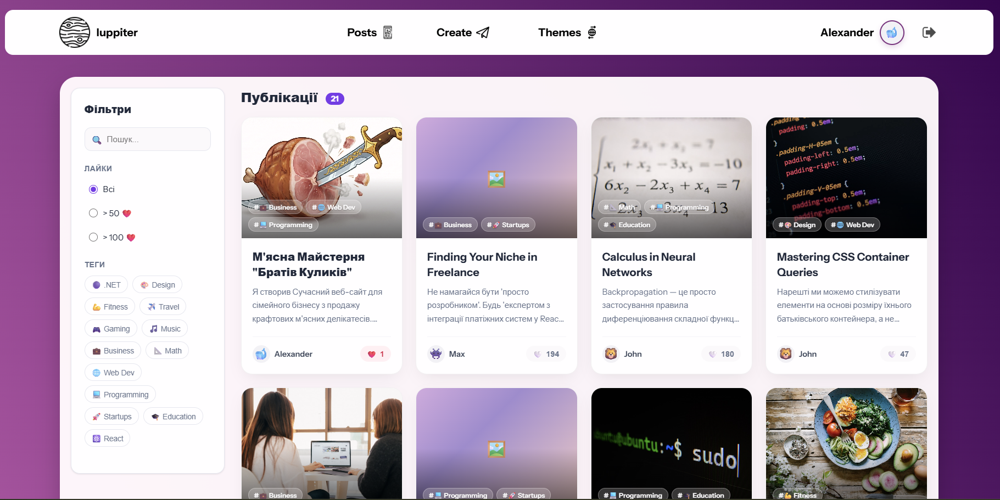
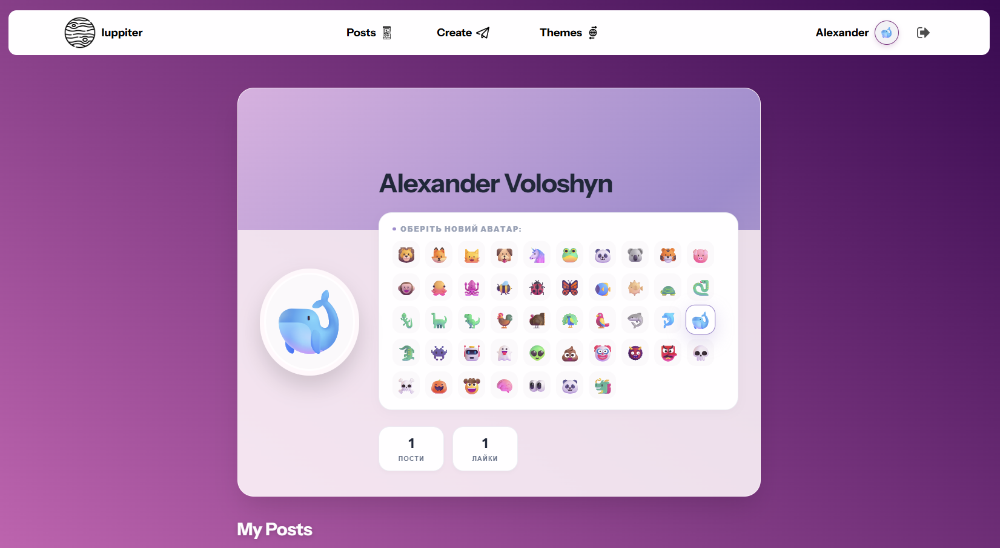
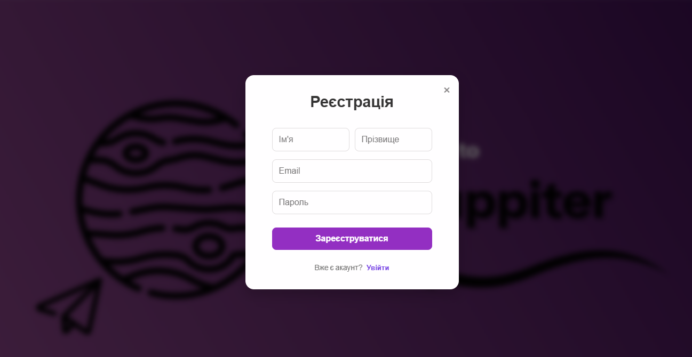
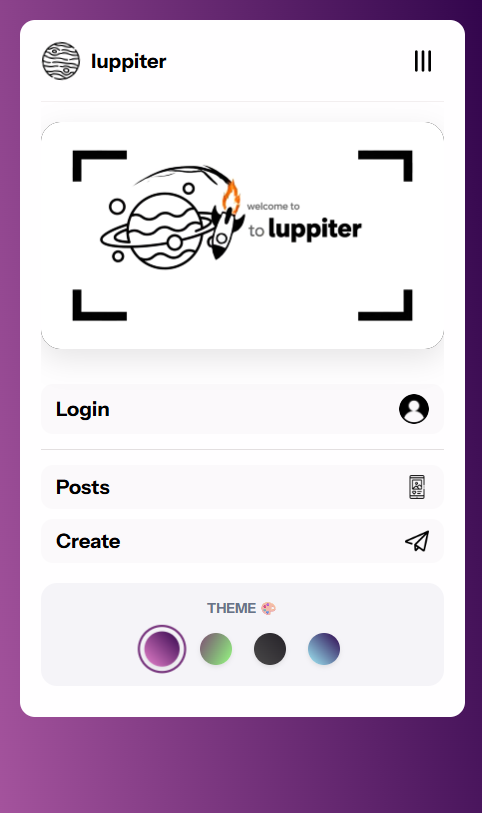
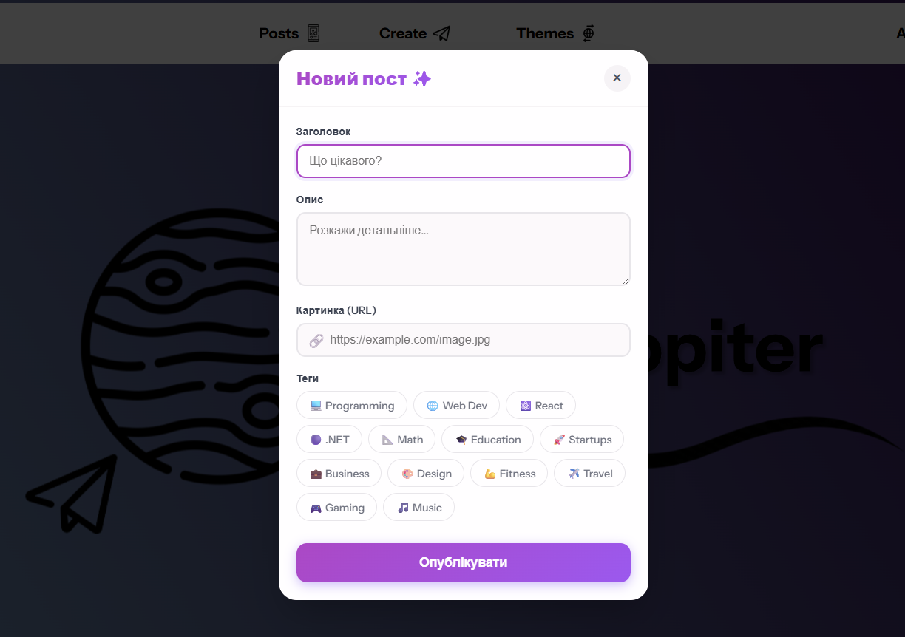

# 🪐 Luppiter — Knowledge Sharing Platform (Client)


> **Luppiter** — це сучасна форум-платформа для обміну знаннями з акцентом на плавний UX, стабільний рендеринг та естетичний інтерфейс.

---

 

---

## 📖 Про проєкт

Luppiter — це клієнтська частина повнофункціонального веб-форуму.  
Проєкт демонструє production-підхід до розробки з використанням **React + TypeScript**.

Основні принципи:

- Відсутність Content Layout Shift (CLS)
- Плавні переходи між сторінками
- Типобезпечність
- Масштабована архітектура
- UX-first підхід

Мета — створити інтерфейс, який виглядає стабільно, сучасно та не викликає візуального дискомфорту.

---

## 🎨 UI / UX

### 🧊 Style

Інтерфейс побудований із використанням:

- напівпрозорих контейнерів
- градієнтів
- м’яких тіней
- сучасної типографіки

---

### 🎬 Cinematic Transitions

Кастомний `GlobalLoader`:

- очікує повного рендерингу сторінки
- усуває CLS
- синхронізується з роутингом
- створює кінематографічний ефект переходу

---

* **Dynamic Theme Engine:** 
- Вбудований двигун тем, що дозволяє користувачам миттєво змінювати настрій інтерфейсу. 
- Реалізовано 4 унікальні градієнтні теми (Luppiter Default, Forest, Night, Space), які перемикаються без перезавантаження сторінки через `ThemeContext`.

 

### 🖼 Smart Image Handling

- Якщо зображення недоступне → генерується CSS-градієнт
- Верстка не "стрибає"
- UX залишається стабільним

---

### 📌 Sticky Sidebar

Бічна навігація залишається доступною під час скролу.

---

## 🔐 Авторизація

### JWT Authentication

- Інтеграція з бекендом
- Збереження токена
- Автоматичне відновлення сесії
- Logout при помилці токена

---

### 🔒 Protected Routes

Реалізовано через React Router v6:

- Неавторизований користувач → модальне вікно входу
- Авторизований → доступ до приватних сторінок

---

## 👤 Персоналізація

### 🎭 Emoji Avatar Generator

- Генерується випадковий емодзі
- Колекція 40+ варіантів

---

### 🏷 Dynamic Tag Filtering

- Миттєва клієнтська фільтрація
- Без зайвих запитів до сервера

---

### Принципи

- Ізоляція стилів (CSS Modules)
- Single Responsibility
- Строга типізація (TypeScript)
- Декларативний роутинг
- Predictable global state через Context API

---

## 🛠 Технологічний стек

### Core (Ядро)
* **[React](https://react.dev/)** — Бібліотека для побудови інтерфейсу.
* **[TypeScript](https://www.typescriptlang.org/)** — Типізована мова програмування для надійності коду.
* **[Create React App](https://create-react-app.dev/) (Webpack)** — Інструмент для налаштування та збірки проекту.

### Architecture & State (Архітектура та Стан)
* **Feature-First Architecture** — Модульна структура папок, де все розбито за компонентами.
* **React Context API** — Управління глобальним станом (авторизація, користувач).
* **React Router v6** — Маршрутизація та навігація між сторінками.

### Styling & UI (Стилізація)
* **[CSS Modules](https://github.com/css-modules/css-modules)** — Ізоляція стилів для кожного компонента (файли `*.module.css`).
* **CSS3 Variables** — Використання змінних (`var(--primary)`) для легкої зміни теми.
* **Flexbox & Grid** — Сучасні підходи до верстки макетів.

### Data Fetching (Робота з даними)
* **Fetch API** — Нативний спосіб виконання HTTP-запитів до REST API.

---

## 📸 Огляд Інтерфейсу та Функціоналу

### 1. Головна Стрічка (News Feed)
Тут користувач бачить потік постів, відфільтрований за актуальністю.
* **Функціонал:** Швидка фільтрація за тегами (наприклад, `#React`, `#Startups`), пошук у реальному часі та пагінація контенту.
* **Компоненти:** `PostList`, `PostCard`, `UserAvatar`.



---

### 2. Профіль Користувача (User Profile)
Персоналізована сторінка, де відображається вся інформація про автора.
* **Smart Avatar:** Якщо користувач не завантажив фото, система генерує унікальний емодзі-аватар на кольоровому фоні.
* **Статистика:** Відображення кількості постів та сумарних лайків.
* **Контент:** Список усіх публікацій конкретного автора з можливістю швидкого переходу.



---

### 3. Система Авторизації (Auth Flow)
* **Модальне вікно:** Вхід та реєстрація відбуваються у спливаючому вікні (`AuthModal`) поверх основного контенту.
* **Валідація:** Миттєва перевірка полів та обробка помилок (наприклад, якщо пошта вже зайнята) без перезавантаження сторінки.
* **UX:** Плавне перемикання між формами "Вхід" та "Реєстрація".



---

### 4. Мобільна Адаптація (Responsive Design)
Інтерфейс повністю адаптований під будь-які пристрої — від широких 4K моніторів до смартфонів.
* **Grid & Flexbox:** Сітка постів автоматично перебудовується з 3-4 колонок у десктопі до однієї колонки на мобільному.
* **Адаптивне Меню:** На мобільних пристроях навігація оптимізована для економії простору екрана.



--- 

### 5. Створення Контенту (Create Post Flow)
Процес публікації максимально швидким та безшовним.
* **Modal Interface:** Форма створення поста відкривається у модальному вікні поверх стрічки. Це дозволяє користувачеві писати думки, не втрачаючи місця, де він зупинився читати.
* **Smart Inputs:** Зручні поля для введення заголовка, тексту, посилання на зображення та тегів (наприклад, `Tech`, `Life`).
* **Instant Update:** Після натискання "Create", пост миттєво відправляється на сервер, модалка закривається, а стрічка автоматично оновлюється, щоб показати новий запис без перезавантаження сторінки.



## 🏗 Архітектура

```text
src/
├── assets/                 # Статичні медіа-ресурси
│   ├── logo.svg...         # Векторні логотипи та іконки інтерфейсу
│   ├── rocket.svg          # Іконки для декоративних елементів
│   └── video.mp4           # Відео-фони для створення атмосфери
│
├── components/             # UI-компоненти та сторінки
│   ├── AuthModal/          # Модальне вікно авторизації (Вхід/Реєстрація)
│   ├── CreatePostModal/    # Форма створення нового поста
│   ├── GlobalLoader/       # Кінематографічний прелоадер для переходів
│   ├── Header/             # Верхня навігаційна панель
|   ├── Main/               # Контент сайту
│   ├── Footer/             # Підвал сайту
│   ├── PostCard/           # Картка поста (відображення лайків, тегів, фото)
│   ├── UserAvatar/         # Універсальний аватар (підтримка емодзі)
│   ├── HomePage/           # Головна сторінка (стрічка новин)
│   ├── ProfilePage/        # Сторінка профілю користувача
│   ├── PostPage/           # Сторінка перегляду окремого поста
│   ├── Layout.tsx          # Головний шаблон (Wrapper) для сторінок
│   └── ScrollToTop.tsx     # Утиліта для скидання скролу при навігації
│
├── context/                # Управління глобальним станом
│   └── AuthContext.tsx     # Логіка авторизації та збереження сесії
│
├── App.tsx                 # Налаштування React Router та маршрутизації
├── App.css                 # Глобальні стилі та змінні (CSS Variables)
├── data.ts                 # TypeScript інтерфейси (Types)
├── index.tsx               # Точка входу в додаток (React DOM render)
└── react-app-env.d.ts      # Типізація для Create React App

